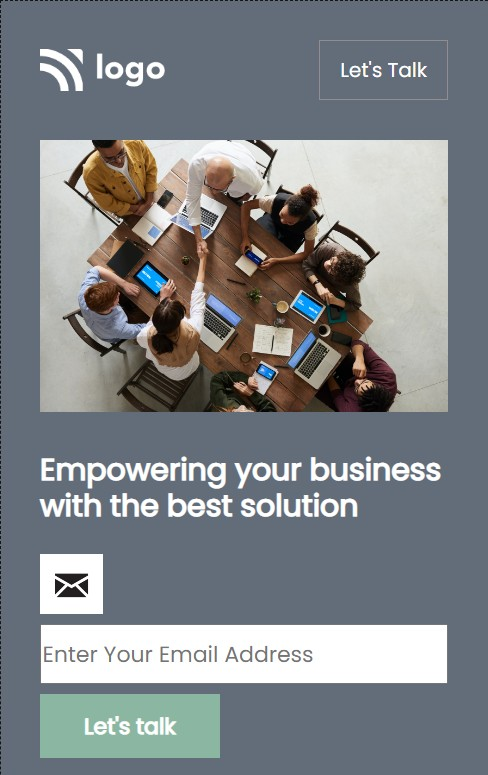

# ⭐ Project 12 : Business Landing Page⭐

## 🔗Project 12 Link
https://htmlcssproject12.netlify.app/

This is a assignment given in **"JavaScript Full Stack Web Developer Bootcamp"** by **iNeuron**, built using **HTML5 and CSS3**.
 

 

## 📌 Tech Stack

&nbsp;
&nbsp;
 
 

## 📌 Overview

 

 "Template Screenshot")

 

 "Template Screenshot")

## 📌 What I Learn

👉 Grid and Flexbox   
👉 **CSS Selectors**   
👉 White space and overflow property   
👉 HTML structuring and targeting CSS elements  
👉 How to create and use variables in CSS   

## Time taken to complete this project was **4 hr**.

## 📬 Connect With Me

- **LinkedIn** - [Pratyush Kesarwani](https://www.linkedin.com/in/pratyush-kesarwani-2b6601171/)

## 📌 Acknowledgments

- Course Instructor - [Hitesh Choudhary](https://github.com/hiteshchoudhary)
